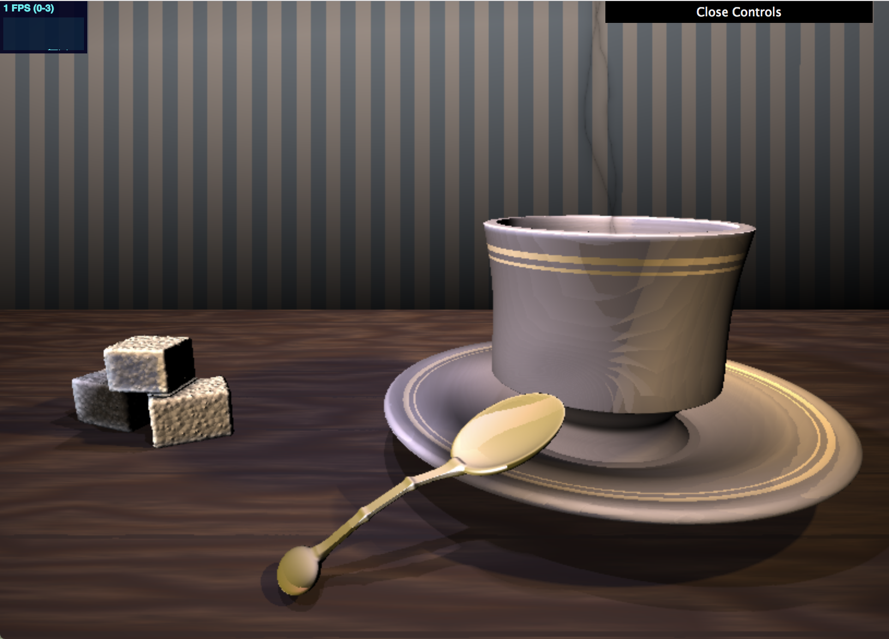

# Grace Gilbert (gracegi), Environment Setpiece
## Demo Link
https://gracelgilbert.github.io/hw03-environment-setpiece/

## Inspiration

I liked the composition of this teacup scene, and I liked the saturated lighting, which are elements I used as indpiration in my project.
## External Resources
- For all of my SDFs, I referenced code from Inigo Quielez's website:
http://iquilezles.org/www/articles/distfunctions/distfunctions.htm
- To get soft shadows, I referenced Inigo Quielez's site again:
https://iquilezles.org/www/articles/rmshadows/rmshadows.htm
- I referenced Adam's subsurface example code to achieve the subsurface effect

## Implementation
### Geometry
#### Sugar Cubes
The base geometry of the sugar cubes is an SDF rounded box with a rounding parameter of 0.1. Layered onto this base geometry is a 3D worley noise displacement along the normals ot the box.  The worley noise is densely packed to give the sense of little sugar crystals. The value obtained from the noise is raised to a power of 0.3 to give the bumps more defined peaks. Overall, the normal offset function is the following:

_0.04 * pow(computeWorley3D(p.x, p.y, p.z, 200.0, 200.0, 200.0), 0.3)_
#### Teacup and Saucer
- The teacup is a combination of SDF capped cones, SDF spheres, and SDF tori. The base of the cup consists of a capped cone with a wider base than top. Right above the cone is a sphere, which is flattened a little in the y direction. A box is subtracted from the sphere to cut it off at a certain height. The main cup shape is one capped cone subtracted from a slightly larger one, creating a conical shape that is slightly wider on the top, with an opening in the center. Subtracted from the cup shape is a large torus. This subtraction creates a curved shape of the cup. The radius of the torus ring is large to make the curve of the cup more subtle.
- The saucer is made of of SDF cones and tori. Base of the plate is a capped cone with a wider base than top.  The plate itself is wider cone with a smaller cone subtracted from it, to give a hollow conical shape with a flat spherical base. A thin torus wraps around the edge of the plate and is smooth blended to the cones to give a rounded rim to the plate. 
#### Spoon
The spoon consists of multiple SDFS blended together.  The scoop part of the spoons is made of an SDF sphere that is elongated in the x direction and flattened in the y direction. A second sphere a little bit above the first is smooth subtracted from the first sphere to create the hollowed out shape. The second sphere is also translated a little bit forward in the x direction to make the tip of the scoop thinner than the back of the scoop. The handle of the spoon is made up of 3 SDF boxes. The boxes are scaled to be very thin and narrow, and they are placed and rotated to create a curved handle. The boxes overlap a little and are smooth unioned together, creating a little bump where they meet that looks like the metal was welded together. Finally, a flattened sphere is smooth unioned onto the end of the handle to creat the endcap of the spoon. 
#### Table
The table is made of an SDF box wide enough to extend the length of the screen.

### Materials
#### Wood
The wood material is a lambertian material with the albedo color creating the woodgrain pattern. The grayscale pattern of the woodgrain is created using a sawtooth function applied to FBM. The FBM is found using the x and z values of the table, and it is stretched in the x direction. In the z direction, the stretching of the noise varies along x and z, making the FBM pattern vary in width along the z axis throughout the table. This prevents the woodgrain from being completely straight across and have subtly wider and narrower grain areas. The FBM value is scaled by 3 and then I take the fract of that value, getting a gradual stepped look. The woodgrain noise function is the following, where zFreq, the stretch amount in z, is a value dependent on x and z:

__1.0 - fract(3.0 * fbm(point.x, point.z, 1.0, 10.0, zFreq))__

I then map this greyscale value to a cosine palette that consists of dark browns and light tans, creating a variety of color in the woodgrain.  This cosine palette gave a coloring that looked a little too contrasted to be realistic, so I mixed it with a solid brown wood color to bring down that contrast.

Layered on top of the wood grain pattern is a more dense FBM pattern stretched along x to give the texture finer detail and make the wood look a little rougher and more natural.
#### Sugar
#### Metal
#### porcelain
#### Wall

### Lighting

### Post Process Elements
