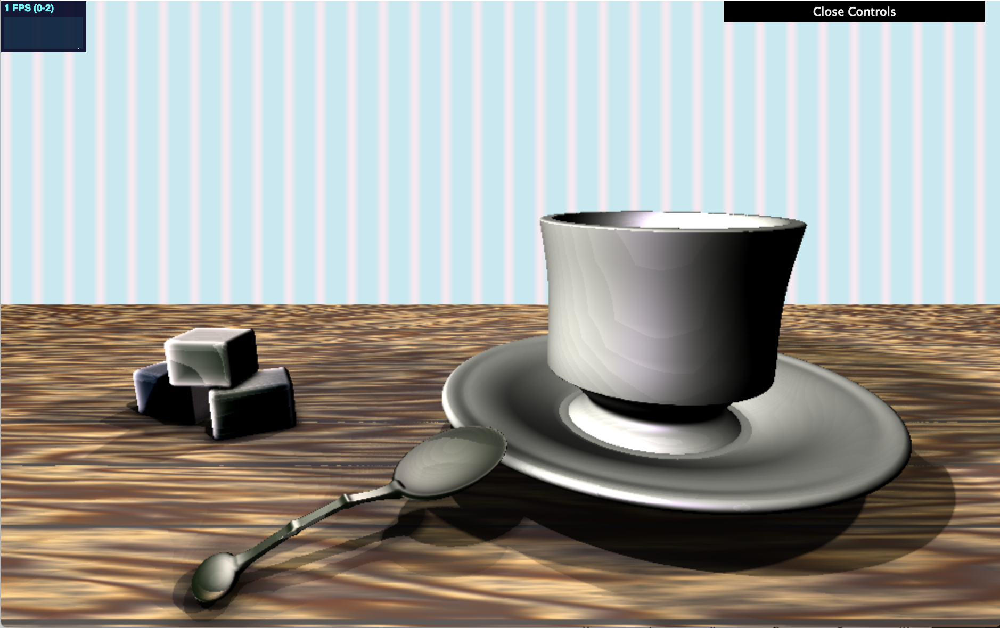

# Grace Gilbert (gracegi), Environment Setpiece
## Demo Link
https://gracelgilbert.github.io/hw03-environment-setpiece/

## Inspiration

I liked the composition of this teacup scene, and I liked the saturated lighting, which are elements I used as indpiration in my project.
## External Resources
- For all of my SDFs, I referenced code from Inigo Quielez's website:
http://iquilezles.org/www/articles/distfunctions/distfunctions.htm
- To get soft shadows, I referenced Inigo Quielez's site again:
https://iquilezles.org/www/articles/rmshadows/rmshadows.htm
- I referenced Adam's subsurface example code to achieve the subsurface effect

## Implementation
### Geometry
#### Sugar Cubes
The base geometry of the sugar cubes is an SDF rounded box with a rounding parameter of 0.1. Layered onto this base geometry is a 3D worley noise displacement along the normals ot the box.  The worley noise is densely packed to give the sense of little sugar crystals. The value obtained from the noise is raised to a power of 0.3 to give the bumps more defined peaks. Overall, the normal offset function is the following:

__0.04 * pow(computeWorley3D(p.x, p.y, p.z, 200.0, 200.0, 200.0), 0.3)__
#### Teacup and Saucer
- The teacup is a combination of SDF capped cones, SDF spheres, and SDF tori. The base of the cup consists of a capped cone with a wider base than top. Right above the cone is a sphere, which is flattened a little in the y direction. A box is subtracted from the sphere to cut it off at a certain height. The main cup shape is one capped cone subtracted from a slightly larger one, creating a conical shape that is slightly wider on the top, with an opening in the center. Subtracted from the cup shape is a large torus. This subtraction creates a curved shape of the cup. The radius of the torus ring is large to make the curve of the cup more subtle. In the future, I might like to add a handle to the teacup using a spiral function to create a shape somewhat like the handle in the reference painting.
- The saucer is made of of SDF cones and tori. Base of the plate is a capped cone with a wider base than top.  The plate itself is wider cone with a smaller cone subtracted from it, to give a hollow conical shape with a flat spherical base. A thin torus wraps around the edge of the plate and is smooth blended to the cones to give a rounded rim to the plate. 
#### Spoon
The spoon consists of multiple SDFS blended together.  The scoop part of the spoons is made of an SDF sphere that is elongated in the x direction and flattened in the y direction. A second sphere a little bit above the first is smooth subtracted from the first sphere to create the hollowed out shape. The second sphere is also translated a little bit forward in the x direction to make the tip of the scoop thinner than the back of the scoop. The handle of the spoon is made up of 3 SDF boxes. The boxes are scaled to be very thin and narrow, and they are placed and rotated to create a curved handle. The boxes overlap a little and are smooth unioned together, creating a little bump where they meet that looks like the metal was welded together. Finally, a flattened sphere is smooth unioned onto the end of the handle to creat the endcap of the spoon. 
#### Table
The table is made of an SDF box wide enough to extend the length of the screen.

### Materials
#### Wood
The wood material is a lambertian material with the albedo color creating the woodgrain pattern. The grayscale pattern of the woodgrain is created using a sawtooth function applied to FBM. The FBM is found using the x and z values of the table, and it is stretched in the x direction. In the z direction, the stretching of the noise varies along x and z, making the FBM pattern vary in width along the z axis throughout the table. This prevents the woodgrain from being completely straight across and have subtly wider and narrower grain areas. The FBM value is scaled by 3 and then I take the fract of that value, getting a gradual stepped look. The woodgrain noise function is the following, where zFreq, the stretch amount in z, is a value dependent on x and z:

__1.0 - fract(3.0 * fbm(point.x, point.z, 1.0, 10.0, zFreq))__

I then map this greyscale value to a cosine palette that consists of dark browns and light tans, creating a variety of color in the woodgrain.  This cosine palette gave a coloring that looked a little too contrasted to be realistic, so I mixed it with a solid brown wood color to bring down that contrast.

Layered on top of the wood grain pattern is a more dense FBM pattern stretched along x to give the texture finer detail and make the wood look a little rougher and more natural.

Finally, I added thin, evenly spaced, straight horizontol lines to give a subtle effect of having individual panels of wood. I used a sin curve that took in the z value to place these lines.

As a possible improvement, I would like to add normal mapping to make the wood texture look 3-dimensional. I would also like to try adding a little specularity to give the wood a little bit of shine.

The following image shows the woodgrain pattern before mixed with the solid brown color:

#### Sugar
The base texture of the sugar uses lambertian shading. In addition to the lambertian shading, I added a subsurface scattering effect. To get this effect, I added a light behind the sugarCubes. When a ray hits the sugar cube, it calculates the scattered ray direction based on the light position. This value is scaled by a thinness parameter, which is calculated using a inward pointing ambient occlusion pass, finding how much of the object exists along the intersection ray direction. This ambient occlusion term calculates the thinness of the object from the camera perspective, and scales the subsurface value up the thinner the surface.  The subsurface value makes the sugar cubes look a little more translucent, giving them a more realistic feel.

With more time, I would like to focus on the base material of the sugar cubes.  Rather than having them be simple lambertian, would maybe add some specularity and texture. 
#### Metal
The spoon metal material is made up of a specular reflective material and a blinn phong specular material. The specular reflection color is found by performing a second ray bounce off of the spoon. This ray originates at the intersection of the camera ray with the spoon.  The bounce direction is the reflection direction of the camera ray with the normal of the spoon. I then calculate what this reflection ray hits in the scene with a separate scene SDF function. This SDF function only takes into account the table, as the spoon reflection does not hit other geometry in the scene.  I also added three subtly colored bright shapes surrounding the spoon to create more interesting reflections and colors in the spoon. Even though there is not much in the scene for the spoon to reflect, adding the extra geometry makes it look like there is a little more in the scene around the spoon to reflect.

The seondary material of the spoon is a basic specular material using blinn phong shading. I raised the specular highlight value to a power of 3, which I found made the highlights sharp and bright enough to look shiny, but to still have a little bit of roughness. I combine this specular material with the reflective color using a fresnel coefficient approximation, increasing the reflection strength based on the angle between the normal of the object and the ray direction from the camera. 
#### porcelain
The porcelain material on the teacup is a specular material using blinn phong shading. The specular strength is enough to give the plate highlighted areas, but not sharp specular highlights, so it looks like a light shine throughout. The base color of the porcelain is a consistent yellow toned white, but it is colored by the lights, which I will discuss below.

There are two golden stripes on the teacup, which are the same material, but with a golden tones albedo, and much stronger, brighter specular highlights to make it look like there is gold detailing on the cup. The placement of the lines on the cup are determined by the height value, so values within certain height ranges get textured the shiny gold. For the lines on the plate, the placement of the color is determined by the distance from the center of the plate, so the lines form a ring around the edge of the plate. Many teacups I looked at had more intricate patterns, but I liked the simplicity of the gold stripes.  Additionally, my scene was already very slow to render, so I chose not to bring in more textures and noise.

#### Wall
The back wall is a simple flat shader patterned with stripes and shaded to give an illusion of depth. A square wave function along the x value is used as a mix value to determine which of the two colors to color the wall, creating the stripes. A gradient is applied vertically, darkening the lower portion of the wall to make it feel shadowed and in 3-dimensional space. This gradient is also gets slightly dark from left to right, adding a little more symmetry and shape.

### Lighting
I really liked the saturated lighting of the reference painting, so while I did not try to mimic this lighting exactly, I wanted to add saturation to my lights. There are three main approximated area lights, as well as ambient lighting. 
- One area light is coming from the front left of the scene. This light has a warm blue hue.  The light is really a point light, but I approximate soft shadows to mimic the effect of an area light. The shadows of this light are relatively sharp, with a k value of 42. The next light is a warm reddish, yellow light shining from the front right. Like the first light, there are approximated soft shadows to mimic an area light. The shadows of this light are very soft, a k value of 24.  The final area light is almost directly above the seen but placed slightly behind the geometry shining towards the camera. This light has a little but of a blue tone, but is more netural than the other two.  It also has a shadow k value of 42.  For the teacup, I altered the placement of this light, lowering it vertically, to reduce a sharp highlight it was creating on the cup. This alteration did not detract from the believability of the scene lighting and reduced the highlight. The combination of the three lights created colorful shadows and saturated the white teacup.  They also created a variety of shadow intensities and shapes, making the scene more dynamic and realistic.
- The ambient light fmakes the minimum shadow value 0.4 for all geometry, so nothing is completely black.
- There are a few additional specialized lights that just affects certain geometry. As mentioned above, the sugar cubes are shaded with approximated subsurface scattering. To bring out this affect, I placed a light right behind the cubes so that the translucency of the sugar material would be evident. The extra geometry that reflects into the spoon also act somewhat as area lights, as their albedo value is above 1, so it behave somewhat as if the spoon is reflecting area lights in the room.

I also added ambient occlusion to some of the geometry. The sugar cubes are shaded with amibient occlusion, as well as the saucer and teacup. I found that adding ambient occlusion did not add very much to the table and spoon, so to increase efficiency, I omitted ambient occlusion from these objects. Ambient occlusion created some unwanted striations in the teacup, which is something I would try to fix with more time. Possibly making the teacup as a warped cone rather than subtracting the torus to get the curve would make its sdfs give smoother, less striated results. Shadows on the teacup also caused bumpy, striated shadow lines, so this alteration of the teacup model might help with that issue as well.

### Post Process Elements
#### Steam
I added animated steam coming from the teacup as a screenspace overlay. I set a certain x position for a line of steam, and using two sin offset curves that are functions of the y value and time, animated that line. In addition to the sin curves, I added an FBM offset to the line to make it look less sinusoidal. I cut off this line at the height of the front lip of the teacup. I then found the horizontal distance from this animated line, and scaled the scene color based on this distance such that pixels near the line got shaded darker than pixels farther from the line. I did this twice, with two lines animated separately. This created an effect that looked like steam rising from the cup.

Something I would want to improve is make it that this line of steam always lines up with the teacup.  Right now, because the steam is created in screen space, if the dimensions of the screen change, the line will no longer be right above the teacup, and it may not align with front lip of the cup. To fix this, I could possibly create a plane that lies in world space just above the teacup and is angled to always face the camera.  I can then apply a transparency map texture to that plane so that the entire plane is tranparent except for the animated lines of steam.
#### Vignette
I added a vignette to the scene in order to give it more warmth and a cozy feeling. To do this, I found the distance of each point in screen space from the center of the screen, and scaled down the color of the scene based on this distance. The farther from the center, the darker the scene becomes. The distance is raised to a power of 0.5, making the vignette just subtley darken the corners and edges. 
