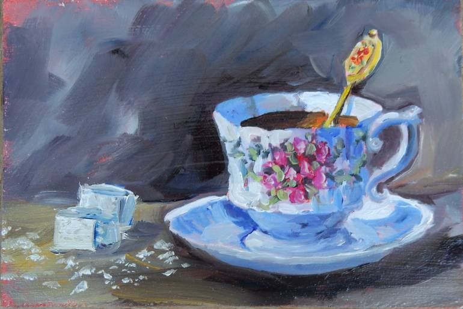

# Grace Gilbert (gracegi), Environment Setpiece
## Demo Link
https://gracelgilbert.github.io/hw03-environment-setpiece/

## Inspiration

I liked the composition of this teacup scene, and I liked the saturated lighting, which are elements I used as indpiration in my project.
## External Resources
- For all of my SDFs, I referenced code from Inigo Quielez's website:
http://iquilezles.org/www/articles/distfunctions/distfunctions.htm
- To get soft shadows, I referenced Inigo Quielez's site again:
https://iquilezles.org/www/articles/rmshadows/rmshadows.htm
- I referenced Adam's subsurface example code to achieve the subsurface effect

## Implementation
### Geometry
#### Sugar Cubes
The base geometry of the sugar cubes is an SDF rounded box with a rounding parameter of 0.1. Layered onto this base geometry is a 3D worley noise displacement along the normals ot the box.  The worley noise is densely packed to give the sense of little sugar crystals. The value obtained from the noise is raised to a power of 0.3 to give the bumps more defined peaks. Overall, the normal offset function is the following:

_0.04 * pow(computeWorley3D(p.x, p.y, p.z, 200.0, 200.0, 200.0), 0.3)_
#### Teacup and Saucer
- The teacup is a combination of SDF capped cones, SDF spheres, and SDF tori. The base of the cup consists of a capped cone with a wider base than top. Right above the cone is a sphere, which is flattened a little in the y direction. A box is subtracted from the sphere to cut it off at a certain height. The main cup shape is one capped cone subtracted from a slightly larger one, creating a conical shape that is slightly wider on the top, with an opening in the center. Subtracted from the cup shape is a large torus. This subtraction creates a curved shape of the cup. The radius of the torus ring is large to make the curve of the cup more subtle.
- The saucer is made of of SDF cones and tori. Base of the plate is a capped cone with a wider base than top.  The plate itself is wider cone with a smaller cone subtracted from it, to give a hollow conical shape with a flat spherical base. A thin torus wraps around the edge of the plate and is smooth blended to the cones to give a rounded rim to the plate. 
#### Spoon
#### Table

### Materials
#### Wood
#### Sugar
#### Metal
#### porcelain
#### Wall

### Lighting

### Post Process Elements
